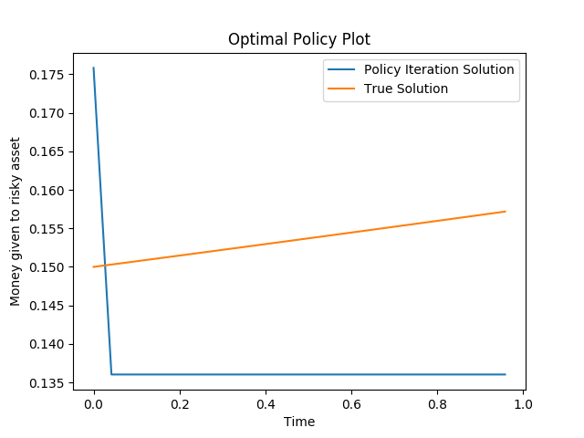

This folder contains the theoretical solution, and a code to solve Assignment 1 using Dynamic Programming.

The theoretical solution is available in the file "Assignment1.pdf"

The solution of the problem as an MDP was done with the following parameters:

a=1;  
mu=0.2;  
r=0.05;  
var=1;  
gamma=0.95;  

Timesteps: 25  
Start time=0;  
End time=1;  

Possible actions: [0.01,1] discretized into 25 uniform intervals  
Possible values of Wealth: [0.01,1] discretized into 25 uniform intervals  

Therefore States of the form (t,Wt): Set product of the time and Wt vectors.The final plot of optimal policy versus time looks like:

MDP is solved using policy iteration, by taking a random policy to begin with.

