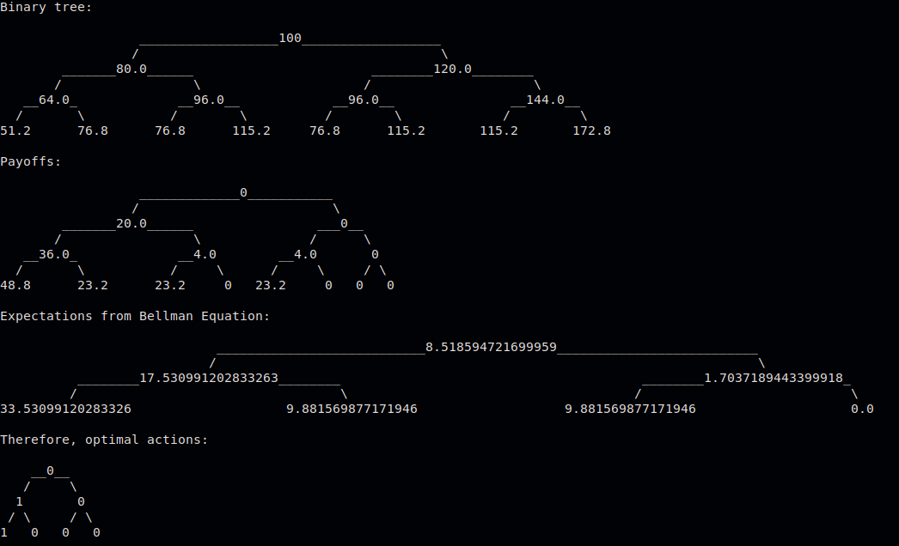

The folder contains several files related to options pricing assignments.

**btree_american_opt.py**:  
This contains code to solve an american option problem: when to optimally exercise option/ arbitrage free pricing method.  
To run the code, the library "binarytree" must be downloaded. Code works for a general problem, if the stock price can be modelled by an increasing/decreasing factor every time.   

The code with current parameters solves for a put option problem, with the following parameters:  
    Initial asset price=100;  
    time to expiry=1.5 units;  
    time intervals at which option can be exercised=0.5;  
    ratio of potential increase of asset price=1.2;  
    ratio of potential decrese of asset price=0.8;  
    strike_price=100;  
    risk free return rate=0.05;  
    
 The problem solution is as shown below:
 
 
 
 Therefore, where the discounted value function is lesser than the immediate payoff from exercising the option, we take action 1, which is use option. 0 means keep option. This way we can also price the option, the difference between the immediate payoff and the expected discounted value function at any time is the no-arbitrage price of the option. The values for the leaf nodes are not included, since at those nodes the solution is trivial.  
 
 The problem parameters and solution is corroborated by the tutorial problem at the following link: https://www.youtube.com/watch?v=35n7TICJbLc

**longstaff_schwartz.py**

Implementation of the longstaff_schwartz algorithm for the above problem. Features described in slides are used. The printed output corresponds to Payoff of exercise, and the expected payoff of not exercising for the current time step. Values corroborated by previous problem.  

**LSPI**  
Implementation of the LSPI algorithm using the same feature functions as longstaff_schwartz. The code is applied to the same problem demonstrated above in the binary tree.
