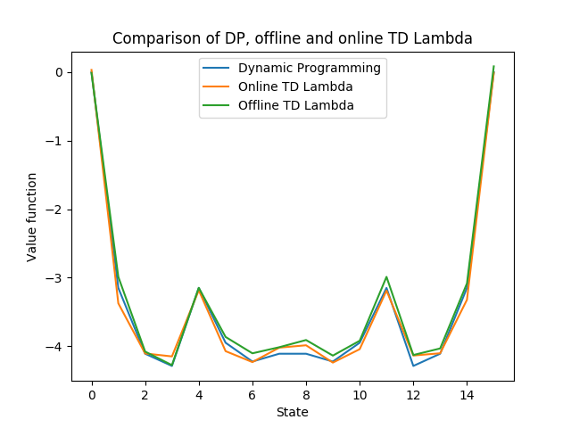
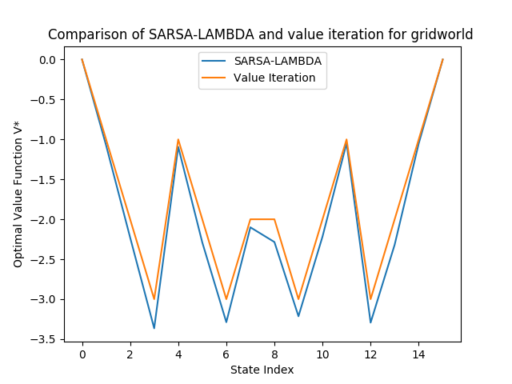
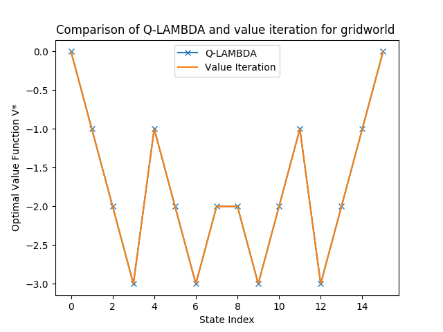

This folder contains code for the implementation of the tabular algorithms for model-free prediction and control. All the algorithms (prediction and control) are tested on the gridworld problem from the early part of the course. The interface uses a sampler that knows the underlying MDP, and returns a next state and a reward given the current state and current action.  

File Functionality:  
1)backward_td_lambda.py: Contains code for offline and online backward TD-LAMBDA algorithms  
2)mdp.py: Contains code for dynamic programming solutions of an MDP  
3)mdp_sampler.py: contains code that can return a sampler object for an underlying mdp, meaning given a current state and action, it returns next state and rewward  
4)q_learning.py: Contains all code for the Q-LAMBDA algorithm  
5)sarsa.py: Contains all code for the SARSA-LAMBDA Algorithm  
6)simulate_griworld.py: Code for executing trial of gridworld   

The algorithms covered are:  

**Prediction**  

1) Online Backward TD-Lambda:   
2) Offline Backward TD-Lambda:  

The policy I aimed at imitating is the random policy shown in the lecture slides.  
The parameters used in the problem were as follows:  

lambd=0.9  
alpha=10**(-2)  
n_episodes=25000  
gamma=1  

The solution through dynamic programming and both the above mentioned algorithms is plotted below:

**Control**

1)SARSA-Lambda:  
2) Q-Lambda:  

Aimed to learn the optimal policy and the optimal value function through both the above mentioned algorithms, and compare to the solution from dynamic programming(Value Iteration).  

The parameters I used in both algorithms were the same, as described below:  

lambd=0.9  
alpha=10**(-2)  
n_episodes=30000  
eps=0.1  

The result for SARSA-LAMBDA is as shown:

The result for Q-LAMBDA is shown:

