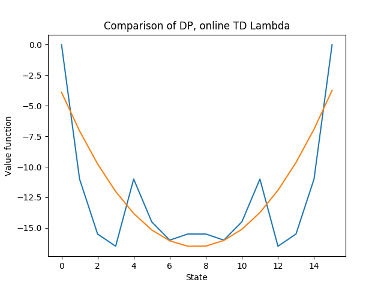

This section contains code for the RL algorithms with value function approximations. The feature functions chosen for the following results are lagrange polynomials:

The description of each file is as follows:
 **Basis**  
 This file creates the lagrange basis function for an arbitary range, of a specified order(or number of features)  
 **backward_td_lambda_vfa**  
 This file contains code to solve an MRP using value function approximation of the Backward TD-lambda method  
 **feature_functions**  
 Contains code to create a feature function object, that contains info about a chosen feature function type. We can chse between lagrange polynomials, polynomial rep(powers of x) and laguerre polynomials  
 **mdp**  
 Functions to solve an MDP with DP  
 **mdp_sampler**  
 Code to create a MDP/MRP sampler object. It returns samples using an underlying MRP, of the next state, reward and next action according to the underlying policy, given a current action and current state. The next_action can be ignored when dealing with control problems  
 **monte_varlo_vfa**  
 Code to solve a prediction problem using the VFA version of Monte carlo  
 **sa_features**  
 Contains code to create a feature function object, that contains info about a chosen feature function type, for a state-action pair. We can choose between lagrange polynomials(the state and action lagrange functions are added to create an (s,a) function), polynomial function(powers of s and a added), or laguerre.  
 **sarsa_vfa**  
 Code to solve a control problem using the VFA version of the SARSA-lambda algorithm  
 
 
 ** Monte Carlo Method**  
  I used the following parameters for the MRP:
  alpha=10**(-1)  
  n_episodes=100000(large numbers)  
  num_features=3  
  Feature type: Lagrange  
  gamma=0.9  
  
  To obtain the following comparison between value iteration for a gridworld, and M.C with VFA:  
  
  
Blue corresponds to dynamic Programming, orange is MC  
**Backward TD Lambda**  

I used the following parameters for the MRP:

lambd=0.9
    
alpha=10**(-3)  
n_episodes=1200   
num_features=3  
gamma=1  
Feature type: lagrange  

Blue corresponds to dynamic Programming, orange is BTD-lambda
